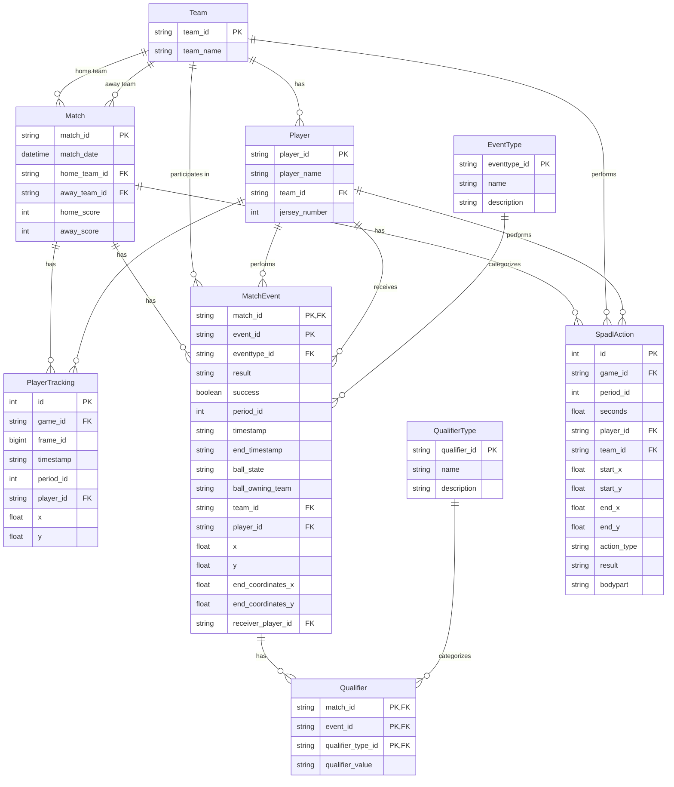

# Soccer Analytics Database Model

This diagram visualizes the database schema for the soccer analytics application.

## Relationship Details

1. **Match and Team**:
   - A Match has one home Team and one away Team
   - A Team can be the home or away Team in many Matches

2. **Team and Player**:
   - A Team has many Players
   - A Player belongs to one Team

3. **Match and MatchEvent**:
   - A Match has many MatchEvents
   - Each MatchEvent belongs to one Match

4. **Player and MatchEvent**:
   - A Player can perform many MatchEvents
   - A Player can receive many MatchEvents (e.g., receiving a pass)
   - MatchEvents can have a Player as performer and another Player as receiver

5. **EventType and MatchEvent**:
   - Each MatchEvent has one EventType
   - An EventType can categorize many MatchEvents

6. **MatchEvent and Qualifier**:
   - A MatchEvent can have many Qualifiers
   - Each Qualifier belongs to one MatchEvent

7. **QualifierType and Qualifier**:
   - Each Qualifier has one QualifierType
   - A QualifierType can be used in many Qualifiers

8. **Match and PlayerTracking**:
   - A Match has many PlayerTracking records
   - Each PlayerTracking record belongs to one Match

9. **Player and PlayerTracking**:
   - A Player has many PlayerTracking records
   - Each PlayerTracking record belongs to one Player

10. **SpadlAction Relationships**:
    - A Match has many SpadlActions
    - A Player can perform many SpadlActions
    - A Team can perform many SpadlActions
