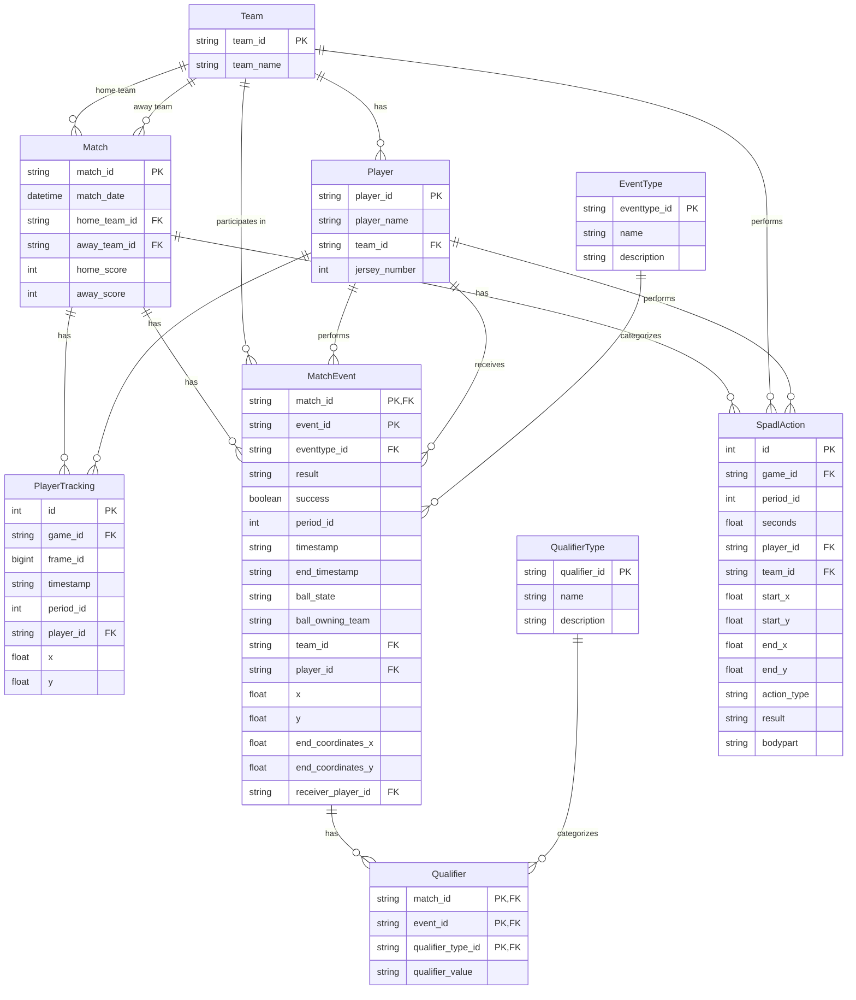

# Prerequisites for Soccer Analytics Pipeline

This document provides an in-depth overview of the soccer analytics pipeline implemented in the `convert.ipynb` notebook. It explains the tools, libraries, and methodologies used to process, analyze, and store soccer data for advanced analytics.

## Pipeline Overview

The `convert.ipynb` notebook implements a comprehensive soccer analytics pipeline that:

1. **Data Loading**: Loads soccer event and tracking data from multiple sources, including raw event logs and positional tracking data.
2. **Data Processing**: Transforms raw data into standardized formats like SPADL (Soccer Player Action Description Language) and calculates advanced metrics such as Expected Threat (xT) and VAEP (Valuing Actions by Estimating Probabilities).
3. **Data Visualization**: Uses Python libraries to create visual representations of the data, such as player positions, action sequences, and team strategies.
4. **Data Storage**: Stores processed data in a PostgreSQL database with a well-defined schema for easy querying and analysis.

This pipeline enables analysts to derive actionable insights from soccer data by combining advanced analytics frameworks with robust data engineering practices.

## Key Libraries and Their Integration

### 1. [Socceraction](https://socceraction.readthedocs.io/en/latest/index.html)

Socceraction is the core library for advanced soccer analytics in the pipeline. It provides tools for converting raw event data into SPADL format and calculating metrics like xT and VAEP.

**How it can be used in the pipeline:**

- Calculates Expected Threat (xT) values with `xthreat.ExpectedThreat()`.
- Extracts features for VAEP modeling with `socceraction.vaep.features`.
- Generates labels for machine learning models with `socceraction.vaep.labels`.

**Benefits:**
- SPADL provides a standardized way to describe player actions, making data suitable for machine learning applications.
- Enables calculation of advanced metrics like xT and VAEP, which provide deeper insights into player and team performance.

### 2. [Expected Threat (xT)](https://socceraction.readthedocs.io/en/latest/documentation/valuing_actions/xT.html)

Expected Threat (xT) is a framework for valuing field positions and actions based on their likelihood of leading to goals.

**How it's used in the pipeline:**
- Implemented via the `socceraction.xthreat.ExpectedThreat` class.
- Fits the model on SPADL-formatted actions to evaluate successful move actions.
- Assigns xT values to actions and stores them in the database.

**Benefits:**
- Quantifies the value of actions beyond goals and assists.
- Highlights players who consistently move the ball into threatening positions.
- Provides context on which actions create the most dangerous opportunities.

### 3.[ VAEP (Valuing Actions by Estimating Probabilities)](https://socceraction.readthedocs.io/en/latest/documentation/valuing_actions/vaep.html)

VAEP is a machine learning framework that evaluates actions based on their impact on scoring or conceding probabilities.

**How it's used in the pipeline:**
- Extracts features using functions like `actiontype` and `bodypart_onehot`.
- Creates labels for scoring and conceding probabilities.
- Trains XGBoost models to predict these probabilities.
- Stores the resulting VAEP values in the database.

**Benefits:**
- Offers a comprehensive valuation of all types of actions on the field.
- Accounts for both offensive and defensive contributions.
- Enables more complete player evaluation by considering the context of each action.

## Data Outputs and Database Schema

### Processed Data Available in the Database

After running the pipeline, users can query a PostgreSQL database containing:

1. **Basic Match Information**:
   - Metadata about matches, teams, and players.
   - Game periods and timestamps.

2. **Event Data**:
   - Raw events like passes, shots, and tackles.
   - Spatial coordinates and outcomes of events.

3. **SPADL-Formatted Actions**:
   - Standardized descriptions of player actions.
   - Start and end positions, body parts used, and action results.

4. **Tracking Data**:
   - Player positions, speeds, and directions over time.
   - Ball position coordinates synchronized with events.

### Database Schema

The pipeline creates a comprehensive database schema with the following key tables:

- `teams`: Stores team information.
- `players`: Contains player details, including positions and jersey numbers.
- `matches`: Includes match metadata like scores and participating teams.
- `matchevents`: Logs raw event data with spatial and temporal details.
- `spadl_actions`: Stores SPADL-formatted actions with calculated metrics.
- `player_tracking`: Tracks player positions and movements over time.

The schema is designed to support complex queries for advanced analytics.

## How to Use This Pipeline

To effectively use this pipeline:

1. **Set Up the Environment**:
   - Create a virtual environment and install the required libraries:
     ```bash
     pip install -r requirements.txt
     ```

2. **Configure Database Connection**:
   - Set up PostgreSQL connection parameters in a `.env` file:
     ```python
     PG_HOST = "fuji.ucll.be"
     PG_PORT = "62425"
     PG_DB = "international_week"
     PG_USER = "local_..."
     PG_PASSWORD = "your_password"
     ```

3. **Run the Notebook**:
   - Execute the notebook cells sequentially to load, process, and store data.

4. **Query and Visualize Data**:
   - Use SQL queries to extract insights from the database.
   - Leverage Python libraries for data visualization.

5. **Database Schema Visualization**:
   - The following mermaid diagram illustrates the database schema:



## Conclusion

This pipeline integrates cutting-edge soccer analytics libraries with robust data engineering practices to create a powerful system for analyzing soccer data. By standardizing data and calculating advanced metrics, it enables analysts to gain deeper insights into player and team performance, paving the way for more sophisticated soccer analytics.